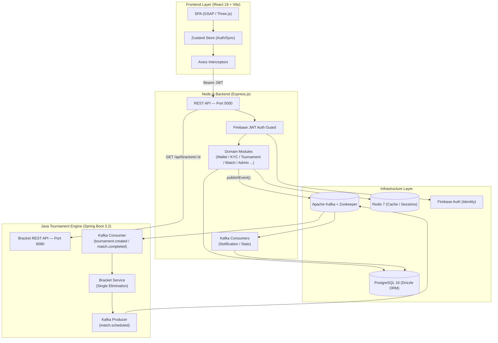

# 🌌 Titan Arena 

Titan Arena is a premium, high-fidelity esports tournament management platform engineered for low-latency tournament orchestration, secure financial transactions, and high-engagement user experiences.


---

## 🏗️ Architecture Overview

Titan Arena is a **polyglot microservices** system. The Node.js backend handles realtime API traffic and publishes domain events to **Apache Kafka**. A dedicated **Java/Spring Boot** engine consumes those events to perform intensive bracket computation and match orchestration, fully decoupled from the user-facing API.



### Event Bus — Kafka Topics

| Topic | Publisher | Consumer(s) |
|---|---|---|
| `user.registered` | Node.js (`userSync.service`) | *(future: welcome emails)* |
| `tournament.created` | Node.js (`tournament.controller`) | Java Engine (bracket gen) |
| `tournament.started` | Node.js (`tournament.controller`) | Node.js Notification Consumer |
| `tournament.ended` | Node.js (`tournament.controller`) | Node.js Notification + Stats |
| `match.completed` | Node.js (`match.controller`) | Java Engine + Notification + Stats |
| `match.scheduled` | Java Engine | Node.js Notification Consumer |
| `wallet.credited` | Node.js (`wallet.service`) | *(future: analytics)* |
| `wallet.debited` | Node.js (`wallet.service`) | *(future: analytics)* |
| `kyc.approved` | Node.js (`kyc.controller`) | *(future: role promotion)* |
| `kyc.rejected` | Node.js (`kyc.controller`) | *(future: user notification)* |
| `dispute.resolved` | Node.js (`dispute.controller`) | *(future: auto-refund)* |

---

## 📂 Project Structure

```text
Esports Tournament Website/
├── docker-compose.yml            # Full stack orchestration (7 services)
├── .env                          # Root env (JWT secrets, SMTP, Firebase, etc.)
│
└── CODE/
    ├── BACKEND/                  # Node.js / Express API (Port 5000)
    │   ├── Dockerfile
    │   ├── package.json
    │   └── src/
    │       ├── index.js          # Entry point, service initialization
    │       ├── config/
    │       │   ├── firebase.config.js
    │       │   ├── redis.config.js
    │       │   ├── kafka.config.js   ← NEW: KafkaJS producer + consumer factory
    │       │   └── regions.config.js
    │       ├── db/
    │       │   ├── index.js
    │       │   └── schema.js         # Drizzle ORM — 25+ tables (source of truth)
    │       ├── middleware/
    │       │   ├── auth.middleware.js
    │       │   └── rateLimiter.js
    │       ├── modules/
    │       │   ├── auth/
    │       │   ├── tournament/
    │       │   │   ├── checkin.controller.js ← NEW: Check-in logic
    │       │   │   ├── tournament.controller.js
    │       │   │   ├── tournament.events.js  ← NEW: Kafka publishers
    │       │   │   ├── tournament.routes.js
    │       │   │   ├── tournament.schema.js
    │       │   │   └── tournament.constants.js
    │       │   ├── match/
    │       │   │   └── match.controller.js   ← publishes match.completed
    │       │   ├── notification/
    │       │   │   ├── notification.controller.js
    │       │   │   └── notification.consumer.js  ← NEW: Kafka consumer
    │       │   ├── stats/
    │       │   │   └── stats.consumer.js    ← NEW: Kafka consumer
    │       │   ├── wallet/
    │       │   │   └── wallet.service.js    ← publishes wallet events
    │       │   ├── dispute/
    │       │   │   └── dispute.controller.js ← publishes dispute.resolved
    │       │   ├── kyc/
    │       │   │   └── kyc.controller.js    ← publishes kyc events
    │       │   ├── admin/
    │       │   │   ├── admin.controller.js
    │       │   │   └── audit.service.js      
    │       │   ├── clans/
    │       │   ├── game/
    │       │   ├── host/
    │       │   ├── social/
    │       │   ├── team/
    │       │   └── payment/
    │       └── services/
    │           ├── achievement.service.js
    │           ├── audit.service.js
    │           ├── email.service.js
    │           ├── hostStats.service.js
    │           ├── mmr.service.js
    │           ├── otp.service.js
    │           ├── stats.service.js
    │           ├── uid.service.js
    │           └── userSync.service.js  ← publishes user.registered
    │
    ├── JAVA-TOURNAMENT-ENGINE/   # Spring Boot 3.2 Microservice (Port 8080)
    │   ├── Dockerfile            # Multi-stage Maven → JRE 21 Alpine
    │   ├── pom.xml               # Spring Boot, Kafka, JPA, PostgreSQL, Lombok
    │   └── src/main/
    │       ├── resources/
    │       │   └── application.yml
    │       └── java/com/titanarena/tournamentengine/
    │           ├── TournamentEngineApplication.java
    │           ├── config/
    │           │   ├── KafkaConfig.java     # Manual ack + idempotent producer
    │           │   └── AsyncConfig.java     # Thread pool for @Async methods
    │           ├── domain/                  # JPA entities + repos co-located
    │           │   ├── Tournament.java
    │           │   ├── Match.java
    │           │   ├── TournamentRepository.java
    │           │   └── MatchRepository.java
    │           ├── bracket/                 # Bracket generation (open for extension)
    │           │   ├── BracketService.java  # Facade — picks strategy by format
    │           │   └── strategy/
    │           │       ├── BracketStrategy.java           # Interface
    │           │       └── SingleEliminationStrategy.java # Phase 2 ✓
    │           │       # ↑ Add DoubleEliminationStrategy / RoundRobinStrategy here
    │           ├── orchestration/           # Match lifecycle coordination
    │           │   ├── MatchOrchestratorService.java
    │           │   └── ParticipantResolverService.java
    │           ├── event/                   # Kafka I/O (not tied to "kafka" impl)
    │           │   ├── consumer/
    │           │   │   └── TournamentEventConsumer.java
    │           │   ├── producer/
    │           │   │   └── MatchEventProducer.java
    │           │   └── dto/
    │           │       ├── inbound/         # Events received from Node.js
    │           │       │   └── TournamentCreatedEvent.java
    │           │       └── outbound/        # Events published by Java engine
    │           │           └── MatchScheduledEvent.java
    │           └── api/                     # REST controllers
    │               └── BracketController.java

    │
    └── FRONTEND/                 # React 19 + Vite SPA (Port 80 via Nginx)
        ├── Dockerfile
        └── src/
            ├── Components/       # Atomic UI, Layouts, WebGL VFX shaders
            ├── lib/              # Axios API client, country/location data
            ├── pages/            # Player / Host / Admin route views
            └── store/            # Zustand global state (Auth/Sync)
```

---

## 🚀 Running the Full Stack

### Prerequisites
- Docker Desktop
- `.env` file configured (see `.env.example`)

### Start All Services
```bash
docker-compose up -d
```

This launches **7 containers**:

| Container | Port | Description |
|---|---|---|
| `esports-frontend` | 80 | React SPA (Nginx) |
| `esports-backend` | 5000 | Node.js API |
| `esports-tournament-engine` | 8080 | Java Bracket Engine |
| `esports-postgres` | 5432 | PostgreSQL 16 |
| `esports-redis` | 6379 | Redis 7 |
| `esports-kafka` | 9092 | Apache Kafka |
| `esports-zookeeper` | — | Kafka coordination |

### Development (without Docker)
```bash
# Backend
cd CODE/BACKEND && npm run dev

# Java Engine (requires DB + Kafka running)
cd CODE/JAVA-TOURNAMENT-ENGINE && mvn spring-boot:run

# Frontend
cd CODE/FRONTEND && npm run dev
```

### Database Migrations
```bash
cd CODE/BACKEND
npm run db:push    # Push Drizzle schema to PostgreSQL
npm run db:studio  # Drizzle Studio UI
```

---

## 🛡️ License & Legal
**Proprietary Software**. Copyright © 2025 Titan E-sports. All rights reserved. Access to this source code does not grant rights for reproduction or redistribution.
